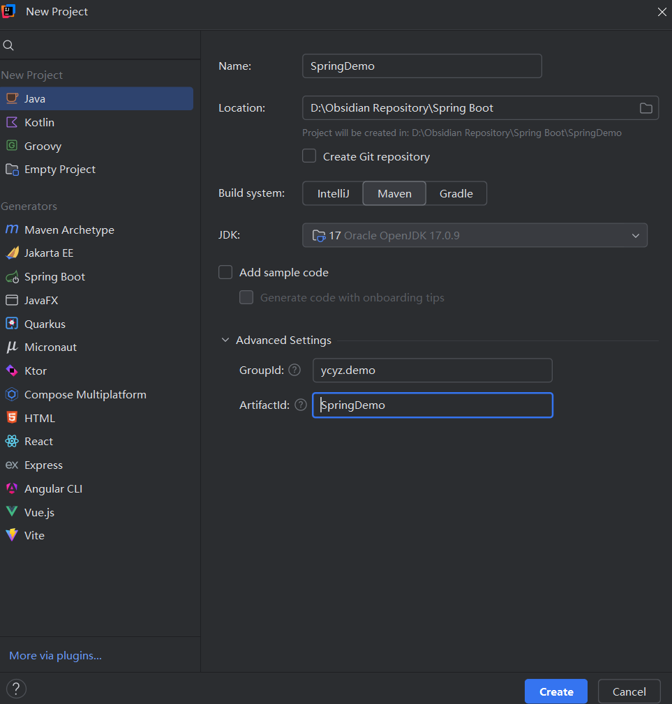

## 使用IDE集成的Spring Initializr 项目

#### 步骤 1: 创建新项目

1. 打开IntelliJ IDEA，选择`File` -> `New` -> `Project`。
2. 在弹出的新建项目窗口中，选择左侧栏中的`Spring Initializr`（IDEA已经将`Spring Initializr`选项直接整合到了`Spring Boot`模板中），然后选择右侧的`Next`。


#### 步骤 2: 配置项目基本信息

1. **Name**: 输入项目名称，例如`SpringDemoZS`。
2. **Location**: 选择项目保存路径。
3. **GroupId**: 输入`ycyz.rjjs.zs`（假设你的名字是张三）。
4. **ArtifactId**: 输入`SpringDemoZS`（与项目名称一致）。
5. **Package name**: 自动填充为`ycyz.rjjs.zs.springdemoZS`。
6. **Type**: 选择Maven Project。
7. **Language**: Java。
8. **Packaging**: Jar。
9. **Java Version**: 根据需要选择合适的版本（如17或以上）。
10. 点击`Next`继续。
11. 图片展示：
    .png>)	


#### 步骤 3: 添加依赖

1. 在`“Dependencies”`搜索框中输入并添加以下依赖：
   - `Spring Web`
2. 确认所有配置无误后，点击`Finish`（`Create`）按钮开始创建项目。
3. 图片展示：
    .png>)

#### 步骤 4: 创建Controller包和HelloController类

1. 在项目结构中找到`src/main/java/ycyz/rjjs/zs/SpringDemoZS`目录。
2. 右键点击该目录，选择`New` -> `Package`，命名为`controller`。
3. 在`controller`包内右键点击，选择`New` -> `Java Class`，命名为`HelloController`。


#### 步骤 5: 编写HelloController类

1. 在`HelloController.java`文件中编写如下代码：

```java
package ycyz.rjjs.zs.SpringDemoZS.controller;

import org.springframework.web.bind.annotation.GetMapping;
import org.springframework.web.bind.annotation.RestController;

@RestController
public class HelloController {

    @GetMapping("/index")
    public String index() {
        return "你好，张三。"; // 如果你叫其他名字，请相应地修改这里
    }
}
```


#### 步骤 6: 运行应用程序

1. 确保主启动类（默认情况下位于`ycyz.rjjs.zs.SpringDemoZS.SpringDemoZSApplication`）已经正确配置。
2. 右键点击主启动类，选择`Run 'SpringDemoZSApplication'`来启动应用。
3. 图片展示：
    


#### 测试

1. 启动应用后，打开浏览器并访问`http://localhost:8080/index`，你应该能看到页面显示“你好，张三。”（如果你的名字不是张三，请根据实际情况调整返回的消息）。
2. 图片如下：


#### 注意事项

- 如果你在运行过程中遇到任何问题，请确保所有的依赖都已经下载完毕，并且Maven配置正确。
- 如果你使用的是Eclipse或其他IDE，步骤大同小异，主要是利用IDE内置的Spring Initializr功能进行项目创建。

通过上述步骤，你就成功地使用IDE集成的Spring Initializr创建了一个Spring Boot项目，并完成了控制器的配置和测试。

---

## 额外补充：社区版可能没有 `Spring Boot` 该模块，则可以这样：

创建一个名为`SpringDemo`的Spring Boot项目，并完成后续的配置和开发工作，因此项目名称为`SpringDemo·，groupID为`ycyz.demo`。项目的`artifactId`保持与项目名称一致，并添加Spring Web依赖，项目创建好后，在启动程序的Java文件的同级目录下创建controller包，并在该包下创建控制器类`HelloController`，创建好该类后在该类中编写处理请求的方法`index()`，该方法请求路径为`/index`，并且该方法返回如下信息：你好，你的姓名（比如我叫张三，则返回：你好，张三。

当然可以，以下是包含项目结构目录的完整指南。这将帮助您了解整个项目的组织方式，并确保所有文件都放置在正确的位置。

#### 完整指南：创建名为 `SpringDemo` 的 Spring Boot 项目


##### 1. 创建 Maven 项目

- **Name**: 输入 `SpringDemo`
- **Location**: 选择或输入项目保存的路径
- **Build system**: 选择 `Maven`
- **JDK**: 选择您的Java开发工具包版本
- **GroupId**: 输入 `ycyz.demo`
- **ArtifactId**: 输入 `SpringDemo`

>如图所示：
    


##### 2. 修改 `pom.xml`

```xml
<project xmlns="http://maven.apache.org/POM/4.0.0" 
         xmlns:xsi="http://www.w3.org/2001/XMLSchema-instance"
         xsi:schemaLocation="http://maven.apache.org/POM/4.0.0 http://maven.apache.org/xsd/maven-4.0.0.xsd">
    <modelVersion>4.0.0</modelVersion>
    
    <groupId>ycyz.demo</groupId>
    <artifactId>SpringDemo</artifactId>
    <version>0.0.1-SNAPSHOT</version>
    <packaging>jar</packaging>

    <name>SpringDemo</name>
    <description>Demo project for Spring Boot</description>

    <parent>
        <groupId>org.springframework.boot</groupId>
        <artifactId>spring-boot-starter-parent</artifactId>
        <version>3.0.0</version> <!-- 使用最新版本 -->
        <relativePath/> <!-- lookup parent from repository -->
    </parent>

    <properties>
        <java.version>17</java.version> <!-- 根据您的Java版本进行调整 -->
    </properties>

    <dependencies>
        <dependency>
            <groupId>org.springframework.boot</groupId>
            <artifactId>spring-boot-starter-web</artifactId>
        </dependency>
    </dependencies>

    <build>
        <plugins>
            <plugin>
                <groupId>org.springframework.boot</groupId>
                <artifactId>spring-boot-maven-plugin</artifactId>
            </plugin>
        </plugins>
    </build>
</project>
```

**然后按顺序同步**：
    


##### 3. 项目结构目录

以下是完成后的项目结构目录示例：

```
SpringDemo/
├── src/
│   ├── main/
│   │   ├── java/
│   │   │   └── ycyz/
│   │   │       └── demo/
│   │   │           └── SpringDemo/
│   │   │               ├── SpringDemoApplication.java
│   │   │               └── controller/
│   │   │                   └── HelloController.java
│   │   └── resources/
│   │       ├── application.properties
│   │       ├── static/
│   │       └── templates/
│   └── test/
│       └── java/
│           └── ycyz/
│               └── demo/
│                   └── SpringDemo/
│                       └── SpringDemoApplicationTests.java
└── pom.xml
```


##### 4. 主应用程序类

在 `src/main/java/ycyz/demo/SpringDemo` 目录下创建 `SpringDemoApplication.java` 文件：

```java
package ycyz.demo.SpringDemo;

import org.springframework.boot.SpringApplication;
import org.springframework.boot.autoconfigure.SpringBootApplication;

@SpringBootApplication
public class SpringDemoApplication {

    public static void main(String[] args) {
        SpringApplication.run(SpringDemoApplication.class, args);
    }
}
```


##### 5. 控制器类

在 `src/main/java/ycyz/demo/SpringDemo/controller` 目录下创建 `HelloController.java` 文件：

```java
package ycyz.demo.SpringDemo.controller;

import org.springframework.web.bind.annotation.GetMapping;
import org.springframework.web.bind.annotation.RestController;

@RestController
public class HelloController {

    @GetMapping("/index")
    public String index() {
        return "你好，张三。"; // 如果你叫其他名字，请相应地修改这里
    }
}
```

**如图：**
    


##### 6. 构建和运行项目

1. 右键点击 `SpringDemoApplication.java` 文件，选择 “Run 'SpringDemoApplication'” 来启动应用。
2. **如图：**
   ![[IDEA(社区运行）.png]]

##### 7. 测试

1. 启动应用后，打开浏览器并访问 `http://localhost:8080/index`，你应该能看到页面显示“你好，张三。”（如果你的名字不是张三，请根据实际情况调整返回的消息）。
2. 如图：
    


##### 总结

通过上述步骤，您已经成功创建了一个完整的 Spring Boot 项目，并且明确了项目的目录结构。每个文件夹和文件都有其特定的作用，如下所示：

- `src/main/java`: 存放所有的 Java 源代码。
- `src/main/resources`: 存放静态资源、配置文件等。
- `src/test/java`: 存放单元测试和其他测试代码。

---


