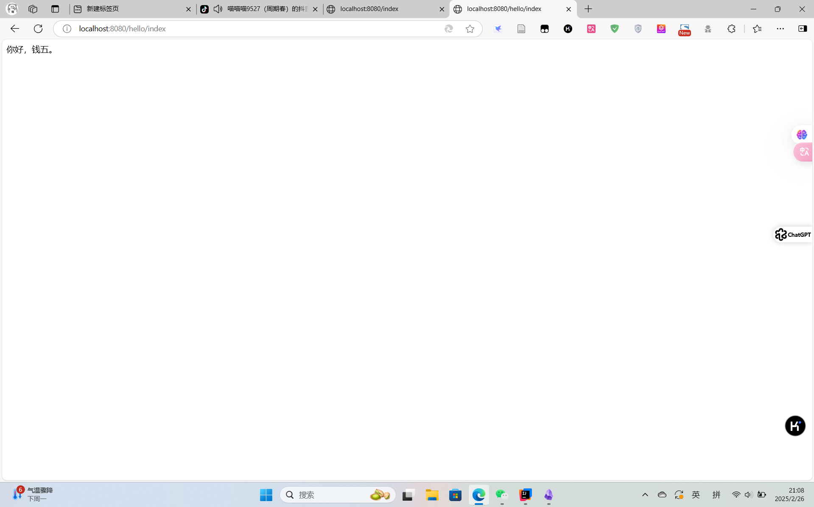

## 一. 使用Spring Initializr在线工具

Spring官方提供了Spring Initializr在线工具，这是最简便的创建Spring Boot项目的途径之一。
- **访问地址**：[https://start.spring.io/](https://start.spring.io/)
- **步骤**：
  - 选择构建工具（如Maven或Gradle）。
  - 选择语言（Java、Kotlin、Groovy等）。
  - 设置项目元数据（如groupId、artifactId、version等）。
  - 选择需要的依赖（如Web、JPA、Security等）。
  - 点击“Generate”按钮下载一个压缩包，解压后即可导入到IDE中开始开发。


## 二、创建项目：

创建一个名为`SpringDemoQW`的Spring Boot项目，并完成后续的配置和开发工作。假设我的姓名首字母是“QW”，因此项目名称为`SpringDemoQW`，groupID为`ycyz.rjjs.qw`。项目的`artifactId`保持与项目名称一致，并添加Spring Web依赖，项目创建好后，在启动程序的Java文件的同级目录下创建controller包，并在该包下创建控制器类`HelloController`，创建好该类后在该类中编写处理请求的方法`index()`，该方法请求路径为`/index`，并且该方法返回如下信息：你好，你的姓名（比如我叫张三，则返回：你好，张三。

---

#### 步骤1: 使用Spring Initializr在线工具创建项目

1. **访问Spring Initializr**：
   - 打开浏览器，访问 [https://start.spring.io/](https://start.spring.io/)。

2. **填写项目信息**：
   - **Project Metadata**：
     - **Group**: `ycyz.rjjs.qw`
     - **Artifact**: `SpringDemoQW`
     - **Name**: `SpringDemoQW`
     - **Description**: 可以留空或填写描述
     - **Package name**: `ycyz.rjjs.qw`
     - **Packaging**: `Jar`
     - **Java**: 选择你使用的Java版本（如11）
   - **Dependencies**：
     - 添加`Web`依赖。

3. **生成项目**：
   - 点击“Generate”按钮，下载生成的压缩包。
   - 解压下载的文件到本地目录。

4. **图片展示**：
    


#### 步骤2: 导入项目到IDE

1. **打开IDEA**：
   - 启动IntelliJ IDEA。
   - 选择`File > Open`，然后选择解压后的项目目录。

2. **等待项目加载**：
   - IDEA会自动加载项目的Maven依赖并进行构建。


#### 步骤3: 创建Controller包和HelloController类
1. **创建controller包**：
   - 在项目结构中找到`src/main/java/ycyz/rjjs/qw`目录。
   - 右键点击该目录，选择`New > Package`，输入`controller`作为包名。

2. **创建HelloController类**：
   - 在`controller`包下右键点击，选择`New > Java Class`。
   - 输入类名`HelloController`。

3. **图片展示**：
    .png>)

#### 步骤4: 编写HelloController类代码

在`HelloController`类中编写处理请求的方法`index()`：

```java
package ycyz.rjjs.qw.controller;

import org.springframework.web.bind.annotation.GetMapping;
import org.springframework.web.bind.annotation.RequestMapping;
import org.springframework.web.bind.annotation.RestController;

@RestController
@RequestMapping("/hello")
public class HelloController {

    @GetMapping("/index")
    public String index() {
        return "你好，钱五。";
    }
}
```

#### 步骤5: 修改启动类

确保启动类位于正确的包路径下，并且包含`@SpringBootApplication`注解：

```java
package ycyz.rjjs.qw;

import org.springframework.boot.SpringApplication;
import org.springframework.boot.autoconfigure.SpringBootApplication;

@SpringBootApplication
public class SpringDemoQWApplication {

    public static void main(String[] args) {
        SpringApplication.run(SpringDemoQWApplication.class, args);
    }
}
```

#### 步骤6: 运行项目并测试
1. **运行项目**：
   - 在IDEA中，右键点击`SpringDemoQWApplication`类，选择`Run 'SpringDemoQWApplication'`。
   - **图片展示**：
   - .png>)

2. **测试接口**：
   - 打开浏览器，访问`http://localhost:8080/hello/index`，你应该能看到返回的信息：“你好，钱五。”
   - **图片展示**：
   - 

通过以上步骤，我们就成功地创建了一个简单的Spring Boot项目，并实现了基本的HTTP请求处理功能。你可以根据实际需求进一步扩展和完善这个项目。